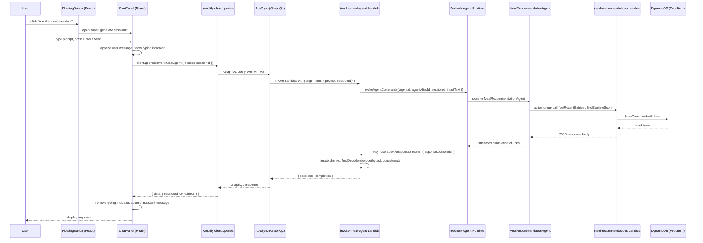

# Design Document — Meal Agent Chat

## Overview

The Meal Agent Chat feature adds a conversational AI panel to the existing Food Tracker page. A floating button fixed to the bottom-right corner of the viewport opens a slide-in side panel where authenticated users can exchange messages with the MealRecommendationAgent — an Amazon Bedrock Agent that has read access to the user's food inventory via an action group Lambda.

The feature is implemented as a thin React UI layer on top of a new AppSync custom query (`invokeMealAgent`). The query is handled by a new Amplify Function (`invoke-meal-agent`) that calls the Bedrock Agent Runtime using the Lambda execution role. No static AWS credentials are used anywhere in the stack.

### Design Goals

- Keep the chat panel self-contained: all state lives inside a single `MealAgentChat` component tree so it can be dropped into the Food Tracker page without touching the page's own state.
- Reuse existing patterns: follow the same `defineFunction` + `a.handler.function()` + `backend.ts` IAM grant pattern already used by `nutrition-summary` and `meal-recommendations`.
- Fail gracefully: every error path — Bedrock call failure, network error, malformed response — produces a user-visible fallback message rather than an unhandled exception or blank UI.

---

## Architecture

### End-to-End Request Flow



### Layer Responsibilities

| Layer | Responsibility |
|---|---|
| `MealAgentChat` (React) | Panel open/close state, session ID lifecycle, message list, input handling |
| `FloatingButton` (React) | Toggle trigger, always visible |
| `ChatPanel` (React) | Renders messages, typing indicator, input area, accessibility attributes |
| AppSync custom query | Typed transport; enforces `allow.authenticated()` authorization |
| `invoke-meal-agent` Lambda | Calls Bedrock Agent Runtime, streams and concatenates response |
| Bedrock Agent Runtime | Routes prompt to MealRecommendationAgent, manages session context |
| `meal-recommendations` Lambda | Action group handler; reads DynamoDB food items |
| DynamoDB `FoodItem` table | Persistent food inventory |

---

## Components and Interfaces

### TypeScript Interfaces

```typescript
// A single turn in the conversation
interface ChatMessage {
  id: string;           // crypto.randomUUID() — stable React key
  role: "user" | "assistant";
  content: string;
  timestamp: number;    // Date.now() at creation
}

// All state owned by the MealAgentChat component
interface ChatPanelState {
  isOpen: boolean;
  sessionId: string;    // crypto.randomUUID(), regenerated on "New conversation"
  messages: ChatMessage[];
  inputValue: string;
  isLoading: boolean;   // true while invokeMealAgent query is in-flight
}

// Shape returned by the AppSync invokeMealAgent query
interface AgentResponse {
  sessionId: string;    // echoed back from the Lambda
  completion: string;   // full concatenated response text
}
```

### React Component Tree

```
FoodTracker (route component — food-tracker.tsx)
└── MealAgentChat
    ├── FloatingButton          — fixed bottom-right, always rendered
    └── ChatPanel               — conditionally rendered / animated
        ├── PanelHeader         — title, "New conversation", close button
        ├── MessageList         — role="log" aria-live="polite", scrollable
        │   ├── UserMessage     — right-aligned, cyan accent
        │   ├── AssistantMessage — left-aligned, slate accent
        │   └── TypingIndicator — animated dots, shown while isLoading
        └── InputArea           — text input + Send button, pinned bottom
```

`MealAgentChat` is the single source of truth for `ChatPanelState`. All child components receive only the props they need — no prop drilling of the full state object.

### FloatingButton Props

```typescript
interface FloatingButtonProps {
  isOpen: boolean;
  onClick: () => void;
}
```

### ChatPanel Props

```typescript
interface ChatPanelProps {
  isOpen: boolean;
  messages: ChatMessage[];
  isLoading: boolean;
  inputValue: string;
  onInputChange: (value: string) => void;
  onSend: () => void;
  onClose: () => void;
  onNewConversation: () => void;
}
```

---

## Data Models

### AppSync Schema Additions (`amplify/data/resource.ts`)

```typescript
AgentResponse: a.customType({
  sessionId: a.string().required(),
  completion: a.string().required(),
}),

invokeMealAgent: a
  .query()
  .arguments({
    prompt: a.string().required(),
    sessionId: a.string().required(),
  })
  .returns(a.ref("AgentResponse").required())
  .handler(a.handler.function(invokeMealAgentFunction))
  .authorization((allow) => [allow.authenticated()]),
```

The existing `authorizationModes` in `defineData` uses `apiKey` as the default. The `invokeMealAgent` query overrides this at the field level with `allow.authenticated()`, which maps to Cognito User Pools. This means the frontend must pass `authMode: "userPool"` when calling this query (or the project must add Cognito auth — see Error Handling section for the interim approach).

> **Note on auth**: The current project uses public API key auth with no Cognito setup. The requirements specify `allow.authenticated()`. The design preserves this requirement as written. During implementation, if Cognito is not yet configured, the team should either add Cognito auth to the Amplify backend or temporarily use `allow.publicApiKey()` as a stepping stone — this is an implementation decision, not a design change.

### Amplify Function Definition (`amplify/functions/invoke-meal-agent/resource.ts`)

```typescript
import { defineFunction } from "@aws-amplify/backend";

export const invokeMealAgentFunction = defineFunction({
  name: "invoke-meal-agent",
  entry: "./handler.ts",
  timeoutSeconds: 60,   // Bedrock Agent responses can take longer than model calls
  resourceGroupName: "data",
});
```

`timeoutSeconds: 60` is chosen because Bedrock Agent invocations involve multi-step reasoning and action group calls, which can take 20–40 seconds under load.

### Lambda Handler Shape (`amplify/functions/invoke-meal-agent/handler.ts`)

```typescript
// Event shape injected by AppSync
interface HandlerEvent {
  arguments: {
    prompt: string;
    sessionId: string;
  };
}

// Return type — matches AgentResponse custom type
interface AgentResponse {
  sessionId: string;
  completion: string;
}
```

### Environment Variables

| Variable | Set in | Value |
|---|---|---|
| `AGENT_ID` | `amplify/backend.ts` | `0PFG4K6M5I` |
| `AGENT_ALIAS_ID` | `amplify/backend.ts` | `VBFPV7MGRM` |
| `AWS_REGION` | Lambda runtime (automatic) | e.g. `us-east-1` |

The agent alias ARN is constructed at synth time in `amplify/backend.ts`:

```typescript
import { Stack } from "aws-cdk-lib";

const { region, account } = Stack.of(
  backend.invokeMealAgent.resources.lambda
);
const agentAliasArn =
  `arn:aws:bedrock:${region}:${account}:agent-alias/${agentId}/${aliasId}`;
```

This avoids hardcoding the account ID or region and works correctly across sandbox and production deployments.

---

## Correctness Properties

*A property is a characteristic or behavior that should hold true across all valid executions of a system — essentially, a formal statement about what the system should do. Properties serve as the bridge between human-readable specifications and machine-verifiable correctness guarantees.*

### Property 1: Session ID is always a valid UUID

*For any* panel open event, the generated session ID SHALL match the UUID v4 format (`/^[0-9a-f]{8}-[0-9a-f]{4}-4[0-9a-f]{3}-[89ab][0-9a-f]{3}-[0-9a-f]{12}$/i`).

**Validates: Requirements 3.1**

### Property 2: New conversation produces a distinct session ID and clears messages

*For any* existing conversation with one or more messages, clicking "New conversation" SHALL produce a session ID that is different from the previous one AND the messages list SHALL be empty immediately after.

**Validates: Requirements 3.3**

### Property 3: Submitted prompt appears in the messages area

*For any* non-empty string submitted as a prompt, the messages area SHALL contain exactly that string as a user message after submission.

**Validates: Requirements 4.1**

### Property 4: Input field is cleared after submission

*For any* non-empty string in the input field, after the user submits it the input field value SHALL be the empty string.

**Validates: Requirements 4.3**

### Property 5: Empty or whitespace-only input is rejected

*For any* string composed entirely of whitespace characters (including the empty string), attempting to submit it SHALL NOT invoke the `invokeMealAgent` query and SHALL NOT add any message to the messages area.

**Validates: Requirements 4.5**

### Property 6: Lambda forwards prompt and sessionId unchanged

*For any* prompt string and session ID string passed to the Lambda handler, the `InvokeAgentCommand` SHALL be constructed with `inputText` equal to the prompt and `sessionId` equal to the session ID — both values unchanged.

**Validates: Requirements 6.2**

### Property 7: Chunk concatenation round-trip

*For any* sequence of byte chunks emitted by the Bedrock completion stream, the Lambda handler SHALL return a `completion` string equal to the concatenation of each chunk's `bytes` field decoded with `TextDecoder`.

**Validates: Requirements 6.3, 6.4, 6.5**

### Property 8: Successful response appears as assistant message

*For any* completion string returned by the `invokeMealAgent` query, the messages area SHALL contain that string as an assistant message and the typing indicator SHALL NOT be present.

**Validates: Requirements 7.1**

### Property 9: User and assistant messages are visually distinct

*For any* conversation containing at least one user message and one assistant message, the CSS classes applied to user messages SHALL differ from those applied to assistant messages (different alignment or background).

**Validates: Requirements 7.2**

### Property 10: Error produces fallback message and re-enables input

*For any* error thrown or returned by the `invokeMealAgent` query, the messages area SHALL contain the string "Sorry, I couldn't get a response. Please try again." as an assistant message, the typing indicator SHALL NOT be present, and both the text input and Send button SHALL be enabled.

**Validates: Requirements 8.1, 8.3**

### Property 11: Enter key submits the same way as the Send button

*For any* non-empty string in the input field, pressing the Enter key SHALL invoke the `invokeMealAgent` query with the same arguments as clicking the Send button would.

**Validates: Requirements 9.5**

---

## Error Handling

### Error Map

| Failure point | Behaviour |
|---|---|
| `InvokeAgentCommand` throws (Bedrock unavailable, throttling, invalid agent ID) | Lambda catches the error, logs it, and returns `{ sessionId, completion: "Sorry, I couldn't get a response. Please try again." }` — does **not** throw, so AppSync receives a valid response |
| `response.completion` stream throws mid-iteration | Same catch block — partial text is discarded, fallback completion is returned |
| AppSync returns `errors` array (Lambda threw despite the catch, or AppSync-level error) | React client checks `errors?.length`, treats it as a network error, displays the fallback message in the chat panel |
| Network error in the React client (fetch fails before AppSync responds) | `try/catch` around `client.queries.invokeMealAgent(...)` catches the thrown error, displays the fallback message, re-enables input |
| Empty completion string returned (Bedrock returned no chunks) | Lambda returns the empty string; the React client displays it as an assistant message — the UI does not break |

### Lambda Error Handling Pattern

```typescript
export const handler = async (event: HandlerEvent): Promise<AgentResponse> => {
  const { prompt, sessionId } = event.arguments;
  const fallback: AgentResponse = {
    sessionId,
    completion: "Sorry, I couldn't get a response. Please try again.",
  };

  try {
    // ... InvokeAgentCommand + stream iteration
    return { sessionId, completion };
  } catch (err) {
    console.error("[invoke-meal-agent] Bedrock call failed:", err);
    return fallback;   // never throw — AppSync gets a valid response
  }
};
```

### React Error Handling Pattern

```typescript
const handleSend = async () => {
  // ... append user message, show typing indicator, disable input
  try {
    const { data, errors } = await client.queries.invokeMealAgent({
      prompt: inputValue,
      sessionId,
    });
    if (errors?.length || !data) throw new Error("Query returned errors");
    appendAssistantMessage(data.completion);
  } catch {
    appendAssistantMessage(
      "Sorry, I couldn't get a response. Please try again."
    );
  } finally {
    removeTypingIndicator();
    setIsLoading(false);   // re-enables input and Send button
  }
};
```

---

## Testing Strategy

### Dual Testing Approach

Unit tests cover specific examples, edge cases, and error conditions. Property-based tests verify universal properties across many generated inputs. Both are necessary for comprehensive coverage.

### Property-Based Testing Library

Use **fast-check** (`npm install --save-dev fast-check`), which integrates cleanly with Vitest and supports async properties.

Each property test runs a minimum of **100 iterations**. Tag format:

```
// Feature: meal-agent-chat, Property N: <property text>
```

### Unit Tests (Vitest + @testing-library/react)

Focus areas:

- **FloatingButton**: renders with correct label, toggles panel open/closed (Requirements 1.1–1.4)
- **ChatPanel structure**: header title, "New conversation" button, close button, messages area, input area (Requirements 2.3–2.6)
- **Typing indicator**: visible while loading, hidden after response (Requirements 4.2, 7.1)
- **Disabled state**: input and Send button disabled while in-flight (Requirement 4.4)
- **Accessibility attributes**: `role="log"`, `aria-live="polite"`, `aria-label` on buttons, focus on open (Requirements 9.1–9.4)
- **Lambda unit test**: `InvokeAgentCommand` called with correct `agentId` and `agentAliasId` (Requirement 6.1)

### Property-Based Tests (fast-check + Vitest)

```
// Feature: meal-agent-chat, Property 1: Session ID is always a valid UUID
fc.assert(fc.asyncProperty(fc.constant(null), async () => {
  // render panel, open it, capture sessionId, assert UUID v4 format
}), { numRuns: 100 });

// Feature: meal-agent-chat, Property 2: New conversation produces distinct session ID and clears messages
fc.assert(fc.asyncProperty(fc.array(fc.string({ minLength: 1 }), { minLength: 1 }), async (prompts) => {
  // send prompts, click "New conversation", assert new sessionId !== old, messages empty
}), { numRuns: 100 });

// Feature: meal-agent-chat, Property 3: Submitted prompt appears in messages area
fc.assert(fc.asyncProperty(fc.string({ minLength: 1 }), async (prompt) => {
  // submit prompt, assert it appears as user message
}), { numRuns: 100 });

// Feature: meal-agent-chat, Property 4: Input field cleared after submission
fc.assert(fc.asyncProperty(fc.string({ minLength: 1 }), async (prompt) => {
  // submit prompt, assert input value is ""
}), { numRuns: 100 });

// Feature: meal-agent-chat, Property 5: Empty/whitespace input is rejected
fc.assert(fc.asyncProperty(fc.stringMatching(/^\s*$/), async (emptyish) => {
  // attempt submit, assert query never called, messages unchanged
}), { numRuns: 100 });

// Feature: meal-agent-chat, Property 6: Lambda forwards prompt and sessionId unchanged
fc.assert(fc.asyncProperty(fc.string({ minLength: 1 }), fc.uuid(), async (prompt, sessionId) => {
  // invoke handler with mocked client, assert InvokeAgentCommand args
}), { numRuns: 100 });

// Feature: meal-agent-chat, Property 7: Chunk concatenation round-trip
fc.assert(fc.asyncProperty(fc.array(fc.string(), { minLength: 1 }), async (chunks) => {
  // mock completion stream with encoded chunks, assert returned completion === chunks.join("")
}), { numRuns: 100 });

// Feature: meal-agent-chat, Property 8: Successful response appears as assistant message
fc.assert(fc.asyncProperty(fc.string({ minLength: 1 }), async (completion) => {
  // mock query to return completion, assert it appears as assistant message, no typing indicator
}), { numRuns: 100 });

// Feature: meal-agent-chat, Property 9: User and assistant messages are visually distinct
fc.assert(fc.asyncProperty(fc.string({ minLength: 1 }), fc.string({ minLength: 1 }), async (userText, assistantText) => {
  // render both message types, assert CSS classes differ
}), { numRuns: 100 });

// Feature: meal-agent-chat, Property 10: Error produces fallback and re-enables input
fc.assert(fc.asyncProperty(fc.oneof(fc.constant(new Error("network")), fc.constant(new Error("throttle"))), async (err) => {
  // mock query to throw err, assert fallback message, input enabled
}), { numRuns: 100 });

// Feature: meal-agent-chat, Property 11: Enter key submits same as Send button
fc.assert(fc.asyncProperty(fc.string({ minLength: 1 }), async (prompt) => {
  // type prompt, press Enter, assert query called with correct args
}), { numRuns: 100 });
```

### Integration Tests

- **AppSync schema**: verify `invokeMealAgent` query is present with correct argument and return types (smoke test, single execution)
- **IAM policy**: verify `bedrock:InvokeAgent` policy is attached to the Lambda execution role (smoke test, single execution)
- **Credential chain**: static analysis / code review confirms no static credential env vars are read in `handler.ts`

### Test File Locations

```
src/
└── components/
    └── __tests__/
        ├── MealAgentChat.test.tsx      # unit + property tests for React components
        └── MealAgentChat.pbt.test.tsx  # property-based tests (fast-check)

amplify/functions/invoke-meal-agent/
└── __tests__/
    ├── handler.test.ts                 # unit tests for Lambda handler
    └── handler.pbt.test.ts             # property-based tests for Lambda handler
```
